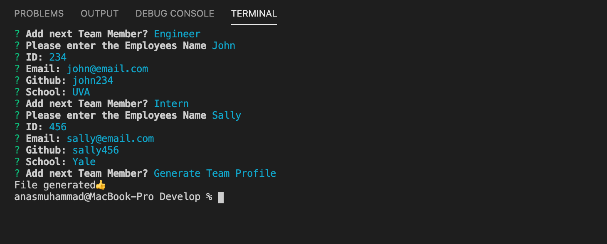
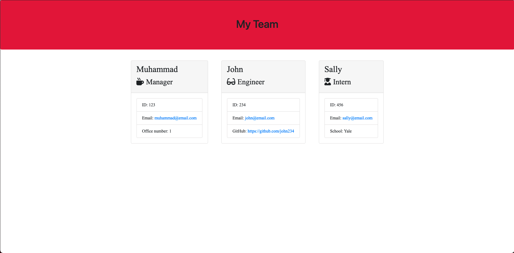

# TeamProfileGenerator

## INTRO
The application will prompt the user for information about the team manager and then information about the team members. The user can input any number of team members, and they may be a mix of engineers and interns. This assignment must also pass all unit tests. When the user has completed building the team, the application will create an HTML file that displays a nicely formatted team roster based on the information provided by the user.

## SCREENSHOTS

## INSTRUCTIONS

1. clone repo using git clone

2. in the develop folder, run npm i to install node modules. 

3. in the develop folder, run node app.js to initiate prompt

4. Once completed, open the team.html file to view your completed TeamProfile.

