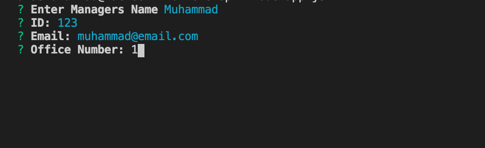

# TeamProfileGenerator

## INTRO
In the command line terminal, a prompt will ask the user for information about the team manager and a mix of associating team members. This assignment must also conduct and validate all unit tests. When the user has completed building the team, the application will create an HTML file which displays a nicely formatted roster based on the information provided by the user.

## SCREENSHOTS

## INSTRUCTIONS

1. clone repo using git clone

2. in the develop folder, run npm i to install node modules. 

3. in the develop folder, run node app.js to initiate prompt

4. Once completed, open the team.html file to view your completed TeamProfile.

